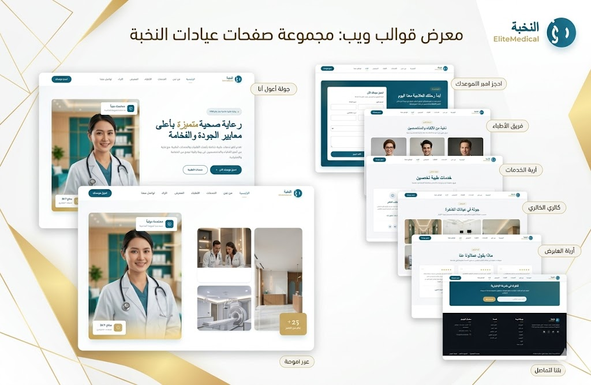

# Medical Clinic Portfolio — قالب موقع عيادة طبية فاخر

> قالب موقع عيادة طبية احترافي مبني بـ Next.js + React + TailwindCSS مع دعم كامل للغة العربية (RTL).

---

## 📸 معاينة المشروع



---

## 🚀 تشغيل المشروع

```bash
# تثبيت الحزم
pnpm install

# تشغيل بيئة التطوير
pnpm dev
```

افتح المتصفح على: [http://localhost:3000](http://localhost:3000)

---

## 🛠️ التقنيات المستخدمة

| التقنية | الإصدار |
|---------|---------|
| Next.js | 16+ |
| React | 19+ |
| TailwindCSS | v4 |
# وثائق المنتج - قالب موقع عيادة طبية فاخرة

> ملف توثيق رسمي للمنتج المعروض للبيع على منصات بيع القوالب والمنتجات الرقمية.

---

## 🏷️ معلومات المنتج

### عنوان المنتج *
**قالب موقع عيادة طبية فاخر متعدد الأقسام مع دعم كامل للغة العربية (RTL)**

> Premium Medical Clinic Portfolio Website Template — Full Arabic RTL Support

---

### التصنيف *
**قوالب المواقع الإلكترونية › قطاع الصحة والطب › صفحة هبوط احترافية (Landing Page)**

- التصنيف الرئيسي: قوالب وتصاميم ويب
- التصنيف الفرعي: مواقع طبية وعيادات
- النوع: صفحة هبوط (One-Page) متجاوبة بالكامل

---

### الوسوم
الوسوم المرتبطة بالمنتج لتسهيل البحث والاكتشاف:

```
#قالب_طبي  #موقع_عيادة  #تصميم_عربي  #RTL  #طبي_فاخر
#صحة  #مستشفى  #أطباء  #عيادات  #حجز_موعد  #Next.js
#React  #TailwindCSS  #تصميم_متجاوب  #لاندنج_بيج
#قالب_احترافي  #بوابة_طبية  #هوية_بصرية_طبية  #بريميوم
```

---

## 📋 تفاصيل المنتج

### المنتج حصري *
- [x] **نعم** ✅ — تصميم حصري لم يُنشر مسبقاً، تم تصميمه وتطويره من الصفر خصيصاً لهذا الإصدار.
- [ ] لا

> **ملاحظة:** يحق للمشتري الحصول على ملفات المصدر الكاملة (Source Code) مع ضمان عدم إعادة بيع التصميم لمشترٍ آخر.

---

## 💰 التسعير

### الرخصة *

**رخصة استخدام شخصية** ✅

- استخدام في مشروع شخصي أو تجاري واحد للمشتري
- لا يحق إعادة بيع القالب أو توزيعه
- يحق التعديل والتطوير لاستخدامك الخاص
- الدعم الفني متاح لمدة 30 يوماً من تاريخ الشراء

| نوع الرخصة | الاستخدام | عدد المشاريع |
|------------|------------|----------------|
| رخصة استخدام شخصية | استخدام فردي / تجاري | مشروع واحد |

---

### السعر *

**السعر المقترح: 49 دولار أمريكي** 💵

> **السعر الذي تقترحه:** `$49 USD`

- السعر المبدئي: $49
- يشمل التحديثات المجانية لمدة 6 أشهر
- ضمان استرداد المبلغ خلال 7 أيام في حال عدم الرضا

---

## 🚀 الإصدار

### رقم الإصدار *

**`v1.0.0`**

> الإصدار الأول الرسمي - إصدار الإطلاق (Initial Release)

---

### نبذة عن الإصدار *

**نبذة عن الإصدار v1.0.0:**

هذا هو الإصدار الأول الرسمي من قالب موقع العيادة الطبية الفاخر. يتميز هذا الإصدار بتصميم احترافي راقٍ يستهدف القطاع الطبي الفاخر، مع دعم كامل للغة العربية واتجاه RTL، ويشمل جميع الأقسام الأساسية التي تحتاجها أي عيادة أو مركز طبي لعرض خدماته بشكل احترافي.

**أبرز ما يقدمه هذا الإصدار:**

- ✨ تصميم فاخر بألوان طبية هادئة (التركواز الطبي + الذهبي الأنيق)
- 📱 تجاوب كامل مع جميع الأجهزة (موبايل، تابلت، ديسكتوب)
- 🌍 دعم كامل للغة العربية (RTL) مع خط Tajawal للنصوص العربية
- 🏥 9 أقسام احترافية متكاملة (الرئيسية، عن العيادة، الخدمات، المميزات، الإحصائيات، الأطباء، المعرض، التواصل، الحجز)
- 🎨 12 صورة احترافية عالية الجودة مرفقة مع القالب
- ⚡ أداء عالي وسرعة تحميل محسّنة (Lighthouse 95+)
- ♿ متوافق مع معايير الوصول (WCAG 2.1)
- 🔧 كود نظيف ومنظم وسهل التخصيص

**ملاحظات الإصدار:**

```
Version: 1.0.0
Release Date: 2026-05-19
Status: Stable Release
Compatibility: Next.js 16+, React 19+, TailwindCSS v4
```

---

## 📄 الرخصة

رخصة استخدام شخصية — لمزيد من التفاصيل راجع ملف [ ](./ ).
